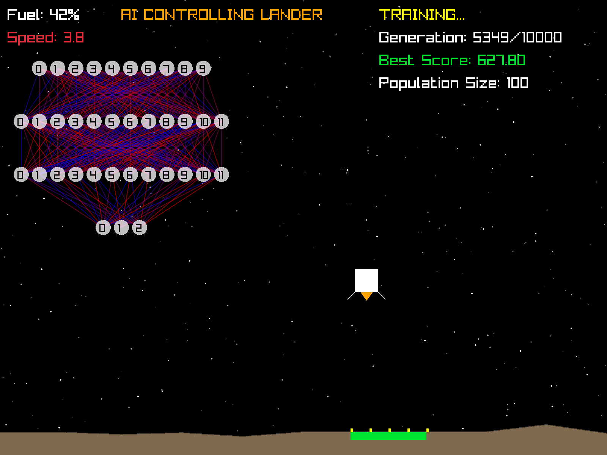

# NNLander - 制御システムのための最小限のニューラルネットワーク



シンプルな2D月面着陸シミュレーションゲームに応用されたニューラルネットワーク。

## 概要
このワークショップでは、制御システムの概念、シミュレーション環境、ニューラルネットワークの入出力から始まる、ニューラルネットワークの制御システムへの応用について実践的な入門を提供します。

## ワークショップの段階
ワークショップのスライドについては[slides/slides.pdf](slides/slides.pdf)を参照してください。

### 前提条件
- CMake（3.10以上）
- C++コンパイラ（C++20をサポート）
- Git（Raylibの取得用）

システムセットアップについては以下を参照してください：
- [ワークショップ要件 EN](workshop_requirements_nn_en.txt)（英語）
- [ワークショップ要件 JA](workshop_requirements_nn_ja.txt)（日本語）

### 実行ファイルのビルド
Linux/macOSの場合：
```bash
./build.sh
```
Windowsの場合：
```bash
./build.bat
```

### 実行ファイルの実行
Linux/macOSの場合：
```bash
./build/bin/lander01
./build/bin/lander02
./build/bin/lander03
./build/bin/lander04
```
Windowsの場合：
```bash
.\build\bin\Release\lander01.exe
.\build\bin\Release\lander02.exe
.\build\bin\Release\lander03.exe
.\build\bin\Release\lander04.exe
```

#### Visual Studioの使用
1. `build`フォルダ内の.slnファイルを開く
2. ドロップダウンメニューから実行したいプロジェクト（例：`lander01`）を選択
3. `Release`構成を選択
4. F5キーを押してビルドと実行を行う

## プロジェクト構造
```
NNLander/
├── README.md                     # メインドキュメント
├── README_ja.md                  # 日本語ドキュメント
├── workshop_requirements_nn_en.txt  # 要件（英語）
├── workshop_requirements_nn_ja.txt  # 要件（日本語）
├── CMakeLists.txt                # メインCMake設定
├── build.sh                      # Linux/macOS用ビルドスクリプト
├── build.bat                     # Windows用ビルドスクリプト
├── Common/                       # すべてのランダーで共有されるコード
│   ├── Simulation.h              # 物理学とゲームシミュレーション
│   ├── SimulationDisplay.h       # レンダリング機能
│   ├── SimpleNeuralNet.h         # ニューラルネットワーク実装
│   ├── DrawUI.h                  # UIレンダリングコンポーネント
│   └── Utils.h                   # ユーティリティ関数
├── Lander01/                     # 手動制御の実装
│   ├── lander01.cpp              # メインプログラム
│   └── CMakeLists.txt            # ビルド設定
├── Lander02/                     # 基本的なニューラルネットワーク実装
│   ├── lander02.cpp              # メインプログラム
│   └── CMakeLists.txt            # ビルド設定
├── Lander03/                     # 改良されたニューラルネットワーク実装
│   ├── lander03.cpp              # メインプログラム
│   └── CMakeLists.txt            # ビルド設定
├── Lander04/                     # 高度なニューラルネットワーク実装
│   ├── lander04.cpp              # メインプログラム
│   └── CMakeLists.txt            # ビルド設定
├── slides/                       # ワークショッププレゼンテーション資料
└── build/                        # ビルド出力ディレクトリ
```

## ゲーム操作（Lander01用）
- **上矢印**：推進力を適用
- **左矢印**：左側に推進力を適用
- **右矢印**：右側に推進力を適用
- **スペース**：着陸または墜落後にゲームを再開

## ゲーム目標
- 緑色の着陸パッドに安全に着陸する
- 降下速度を制御する（1.5単位未満であること）
- 燃料消費を管理する

## 連絡先
*Davide Pasca*:
- [davide@newtypekk.com](mailto:davide@newtypekk.com)
- [github.com/dpasca](https://github.com/dpasca)
- [newtypekk.com](https://newtypekk.com)
- [x.com/109mae](https://x.com/109mae)