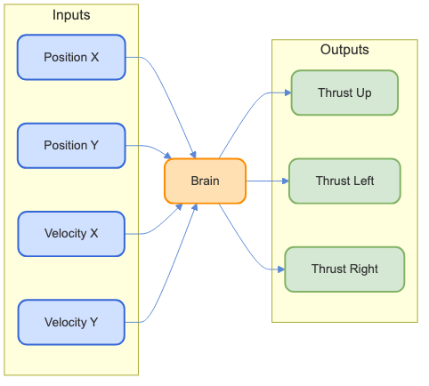
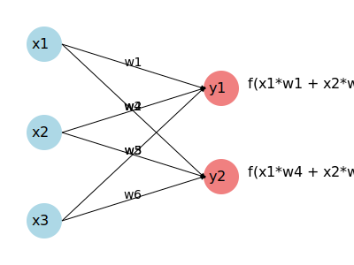
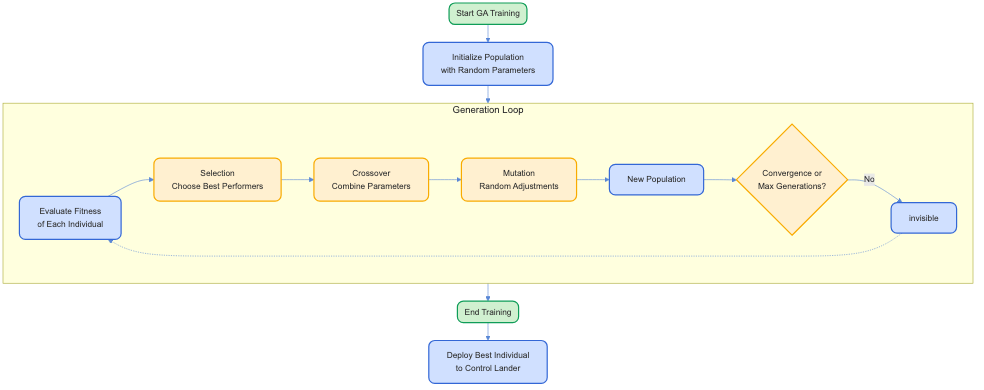
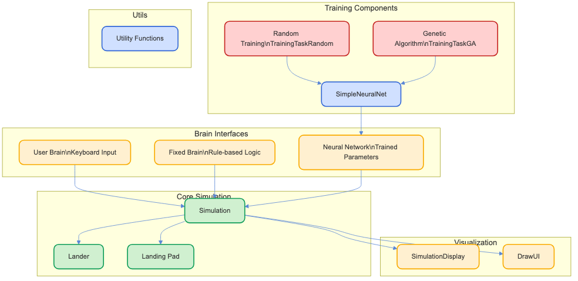

<!-- _class: centered -->

# NNLander

## Minimal Neural Networks for Control Systems
## 制御システムのための最小限のニューラルネットワーク

> An alternative introduction to Neural Networks
> ニューラルネットワークへの別のアプローチ

<br>
<br>

<div style="text-align: right; font-size: 0.8em;">by Davide Pasca</div>
<div style="text-align: right; font-size: 0.8em;">v 1.0</div>

<div style="position: absolute; bottom: 20px; left: 0; right: 0; text-align: center; font-size: 0.8em;">
<a href="https://github.com/dpasca/NNLander">https://github.com/dpasca/NNLander</a>
</div>

---

# Quickstart

| | | |
|---|---|---------------|
| 1 | See the requirements | [English](workshop_requirements_nn_en.txt) or [日本語](workshop_requirements_nn_ja.txt) |
| 2 | Clone this repo | `git clone git@github.com:dpasca/NNLander.git` |
| 3 | Launch the build | `./build.sh` or `build.bat` |
| 4 | Run the demos | `./build/bin/Lander01` or<br>`build\bin\Release\Lander01.exe` |

---

# Goal of this workshop

We aim to demistify NNs by looking at how they work in practice.
このワークショップの目標は、実際にどのように動作するかを見てニューラルネットワークを解明することです。

Actual NNs fundamentals are interesting but confusing !
実際のニューラルネットワークの基礎は興味深いですが、混乱を招きます！

It will still be confusing, it takes time to truly understand something.
それでも混乱するでしょうが、何かを本当に理解するには時間がかかります。

---

# The Lander Simulation/Game

<div class="split">
<div>
An excellent way to apply NNs. A well defined problem with a set of Inputs and
expected Outputs.

ニューラルネットワークを適用する優れた方法です。入力と期待される出力が明確に定義された問題です。
</div>
<div>

</div>
</div>

---

# Lander01: Manual Control

### Human Brain Interface

- User sees → user presses keys → simulation changes
  ユーザーが見る → キーを押す → シミュレーションが変わる
- Up arrow: vertical thrust
  上矢印: 垂直推力
- Left/right arrows: horizontal thrust
  左右矢印: 水平推力

Try to land on the pad, softly ! (below speed 1.5)
パッドに着陸してみてください、優しく！（速度1.5以下）

---

# Lander02: Rule-based AI

### Fixed Brain Approach

- Pre-programmed rules based on programmer's observation
  プログラマーの観察に基づいた事前プログラムされたルール
- Simple `if-then` logic for different conditions
  異なる条件に対する単純な`if-then`ロジック
- No learning - just fixed behavior
  学習なし - 固定された動作のみ

---

# Lander02: Rule-based AI - Benefits & Limitations

- **Benefits**: Predictable, explainable behavior, efficient
  **利点**: 予測可能で説明可能な動作、効率的
- **Limitations**:
  - Limited adaptation to new scenarios
    新しいシナリオへの適応が限られている
  - Rules must be manually crafted
    ルールは手動で作成する必要がある
  - Complexity increases with more edge cases
    エッジケースが増えると複雑さが増す

---

# Neural Networks are just equations !

NNs are a fancy way of writing equations.
Think of a set of equations that map inputs ($x_1$, $x_2$, $x_3$, ...) to outputs ($y_1$, $y_2$, $y_3$, ...).

ニューラルネットワークは方程式を書くための洗練された方法です。
入力（$x_1$, $x_2$, $x_3$, ...）を出力（$y_1$, $y_2$, $y_3$, ...）にマッピングする一連の方程式を考えてみて

> $f(x_1 \times w_1 + x_2 \times w_2 + x_3 \times w_3 + ...) = y_1$
> $f(x_1 \times w_4 + x_2 \times w_5 + x_3 \times w_6 + ...) = y_2$

---

# Neural Networks are just equations !

<div class="split">
<div>
The "brain" is in the weights of the equations.

「脳」は方程式の重みにあります。

> $f(x_1 \times w_1 + x_2 \times w_2 + x_3 \times w_3 + ...) = y_1$
> $f(x_1 \times w_4 + x_2 \times w_5 + x_3 \times w_6 + ...) = y_2$

Training is the art of finding the best weights that give desired Outputs for given Inputs.

トレーニングは、与えられた入力に対して望ましい出力を得るための最適な重みを見つける技術です。
</div>
<div>
<div style="display: flex; justify-content: center; align-items: center;">
  
</div>
</div>

---

# Computer code can be written as equations

## Classical Code (if-then, rule-based)
## 古典的なコード（if-then、ルールベース）
```
if landerX < targetX
  stickPosRight = true
else
  stickPosRight = false
```

## Neural Network
```
stickPosRight = is_positive(w1 * targetX + w2 * landerX)
w1 =  1
w2 = -1
```

---

# Computer code can be written as equations

Assume that our lander's X position is 10 and the target is 15.
我々のランダーのX位置が10で、ターゲットが15であると仮定します。

```cpp
landerX = 10 // Input 1
targetX = 15 // Input 2

w1      =  1 // Weight 1
w2      = -1 // Weight 2

stickPosRight = is_positive(w1 * targetX + w2 * landerX)
stickPosRight = is_positive(1 * 15 + -1 * 10)
stickPosRight = is_positive(15 - 10)
stickPosRight = is_positive(5)
stickPosRight = true // Output !
```

---

# Finally, NNLander with Neural Networks


---

# Lander03: Neural Network Training

### Random Training Approach

- Assing random numbers to all of the weights, and test the simulation.
  すべての重みにランダムな数値を割り当て、シミュレーションをテストします。
- Weights with best score are kept.
  最良のスコアを持つ重みが保持されます。
- Repeat... maybe we get lucky in 10,000 years.
  繰り返します... 10,000年後に運が良ければ。

Highly inefficient "dumb" training.
非常に非効率な「愚かな」トレーニング。

---

# Lander04: Genetic Algorithm Training

Based on natural selection. `-` 自然選択に基づく。

### Population-based Training

- Maintain a population of neural networks
  ニューラルネットワークの集団を維持する
- Use genetic principles: selection, crossover, mutation
  遺伝的原理を使用する：選択、交叉、突然変異
- Evolve better solutions over generations
  世代を重ねてより良い解決策を進化させる

---

# Genetic Algorithm Process



---

# Lander05: REINFORCE-ES Training

REINFORCE-ES is an **Evolution Strategy (ES)** approach, a type of **Reinforcement Learning** algorithm.
REINFORCE-ESは、**強化学習**アルゴリズムの一種である**進化戦略（ES）**アプローチです。

Instead of a large population like GA, it iteratively refines a single network by testing small, random variations ("perturbations") and moving towards the variations that yield better scores.
GAのような大規模な集団の代わりに、小さなランダムな変動（「摂動」）をテストし、より良いスコアをもたらす変動に向かって単一のネットワークを反復的に洗練します。

---

# Lander05: REINFORCE-ES: The Core Idea

Imagine a group of ants exploring a field.
フィールドを探索するアリの群れを想像してください。

Each ant is a feeler that attempts a slightly different direction. Each ants level of success determines the _general direction_ of the group for the next step.
各アリはわずかに異なる方向を試みる触覚です。各アリの成功度が次のステップのグループの「一般的な方向」を決定します。

---

# REINFORCE-ES: The Steps

1.  Create 50 new NNs based on current NN, adding noise to the parameters
    現在のニューラルネットワークに基づいて50の新しいニューラルネットワークを作成し、パラメータにノイズを追加します。
2.  Evaluate Score/fitness of each new NN
    各新しいニューラルネットワークのスコア/フィットネスを評価します。
3.  Noise acts as a "feeler", to find the general direction of good changes
    ノイズは「触覚」として機能し、良い変化の一般的な方向を見つけます。
4.  Update network with the new general direction
    新しい一般的な方向でネットワークを更新します。
5.  Repeat again from step 1
    ステップ1から再度繰り返します。

---
# REINFORCE-ES: Pseudocode
```C++
θ = RandomNN() // Theta is our working Neural Network
σ = 0.1        // Sigma is our chosen noise level
α = 0.01       // Alpha is our chosen learning rate
Loop for max_generations
{
  gradient_estimate = 0 // Initialize gradient-estimate
  // Generate and evaluate perturbations in parallel
  For i = 1 to num_perturbations
  {
    Generate noise vector ε ~ N(0, I) // Standard normal noise

    // Create perturbed parameters (up and down the hill)
    θ_plus  = θ + σ * ε
    θ_minus = θ - σ * ε

    // Evaluate fitness (score) for both perturbations
    fitness_plus  = EvaluateNetwork(θ_plus)
    fitness_minus = EvaluateNetwork(θ_minus)

    // Accumulate gradient-estimate based on fitness difference
    gradient_estimate += (fitness_plus - fitness_minus) * ε
  }
  // Update central parameters using the estimated gradient
  θ = θ + (α / (2 * num_perturbations * σ)) * gradient_estimate
}
```


---

# Comparison of R-ES (Lander05) vs GA (Lander04)

The Genetic Algorithm approach is simpler and more resilient.
遺伝的アルゴリズムのアプローチはよりシンプルでより回復力があります。
R-ES has _sigma_ and _alpha_ hyperparameters that, if not tuned properly, may lead to worse performance than GA !
R-ESには_sigma_と_alpha_のハイパーパラメータがあり、適切に調整されないとGAよりもパフォーマンスが悪化する可能性があります！
R-ES is closer to backpropagation, where NN parameters are updated based on the gradient of the fitness function.
R-ESはバックプロパゲーションに近く、ニューラルネットワークのパラメータはフィットネス関数の勾配に基づいて更新されます。

---

# Beyond Genetic Algorithms and REINFORCE-ES

Backpropagation is a more efficient way to train Neural Networks,
but it comes with its own set of challenges.
バックプロパゲーションはニューラルネットワークを訓練するためのより効率的な方法ですが、それには独自の課題があります。

Feel free to explore !
自由に探求してください！


---

# Key Insights & Takeaways

### Neural Networks Can:

- Learn complex behaviors without explicit programming
  明示的なプログラミングなしで複雑な動作を学習する
- Adapt to changing conditions
  変化する条件に適応する
- Solve problems where rules are hard to define
  ルールを定義するのが難しい問題を解決する

---

# Key Insights & Takeaways

### Important Considerations:

- Training method significantly impacts performance
  トレーニング方法はパフォーマンスに大きな影響を与える
- Scoring/fitness function design is critical
  スコアリング/フィットネス関数の設計が重要
- LLMs are helping us today to write classical code, but more and more problems will be solved just with NNs. Start to think in those terms.
  今日、LLMは古典的なコードを書くのを助けていますが、ますます多くの問題がニューラルネットワークだけで解決されるでしょう。そのように考え始めてください。

---

# Thank You!

**Resources:**
- [OpenAI API Documentation](https://platform.openai.com/docs/)
- [Ollama Project](https://ollama.ai/)
- [Node.js Documentation](https://nodejs.org/en/docs/)

**Contact:**

*Davide Pasca*:
- [davide@newtypekk.com](mailto:davide@newtypekk.com)
- [github.com/dpasca](https://github.com/dpasca)
- [newtypekk.com](https://newtypekk.com)
- [x.com/109mae](https://x.com/109mae)

---

# Appendix: Simulation Components

<div style="display: flex; justify-content: center; align-items: center;">
  
</div>