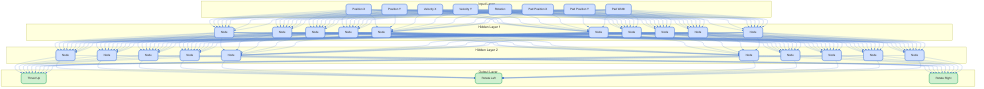
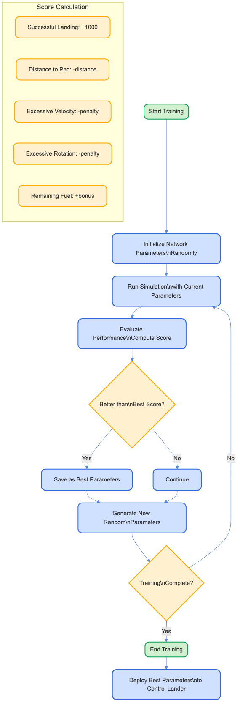

<!-- _class: centered -->

# NNLander

## Minimal Neural Networks for Control Systems

### A Hands-on Workshop

---

# Workshop Overview

### What We'll Learn Today

- **Understanding Neural Networks**: Core concepts and applications
- **Simulation Environment**: 2D lunar lander with physics
- **Progressive Learning**:
  1. Manual Control (Human Brain)
  2. Rule-based AI (Fixed Brain)
  3. Neural Network with Random Training
  4. Neural Network with Genetic Algorithm
- **Hands-on Experience**: Building, running and training neural networks

---

# Workshop Requirements

### Technical Prerequisites

- C++ development environment
- CMake (3.10+)
- Git
- Text editor or IDE (VS Code recommended)

### Recommended Background

- Basic understanding of C++
- Curiosity about neural networks
- No prior machine learning experience required

---

# Neural Network Fundamentals

### Key Concepts

- **Artificial Neurons**: Process inputs and produce outputs
- **Network Layers**: Input, hidden, and output layers
- **Weights & Biases**: Parameters that get adjusted during training
- **Activation Functions**: Non-linear transformations (ReLU, sigmoid, etc.)
- **Training**: The process of finding optimal parameters

---

# Neural Network Architecture

  

---

# Simulation Overview

### Core Components

- **Lander**: Spacecraft with physics-based movement
- **Environment**: Moon surface with landing pad
- **Controls**: Thrust (up) and rotation (left/right)
- **States**: Position, velocity, rotation, fuel, etc.
- **Scoring**: Based on landing success, fuel efficiency, and accuracy
- **Brain Interface**: Input = simulation state, Output = control actions

---

# NNLander in Action

  

---

# Simulation Components

  

---

# Lander01: Manual Control

### Human Brain Interface

- Direct keyboard control by the user
- Up arrow: Apply thrust
- Left/right arrows: Rotate lander
- Space: Restart after landing/crashing

### Learning Objectives
- Understand the physics of the simulation
- Experience the difficulty of manual landing
- Identify patterns for successful landings

---

# Lander02: Rule-based AI

### Fixed Brain Approach

- Pre-programmed rules based on observation
- Simple if-then logic for different conditions
- No learning - just fixed behavior

### Benefits & Limitations
- **Benefits**: Predictable, explainable behavior
- **Limitations**:
  - Limited adaptation to new scenarios
  - Rules must be manually crafted
  - Complexity increases with more edge cases

---

# Lander03: Neural Network Training

### Random Training Approach

- Neural network with randomly generated parameters
- Run many simulations with different parameters
- Keep the best performing network

### Training Process
- Initialize parameters randomly
- Evaluate performance (scoring)
- Save parameters if they're better than the best so far
- Repeat for many epochs

---

# Random Training Process

  

---

# Lander04: Genetic Algorithm Training

### Population-based Training

- Maintain a population of neural networks
- Use genetic principles: selection, crossover, mutation
- Evolve better solutions over generations

### Benefits
- More efficient search of parameter space
- Can escape local optima
- Faster convergence to good solutions

---

# Genetic Algorithm Process

  

---

# Comparing the Approaches

| Approach | Advantages | Limitations | Learning |
|----------|------------|-------------|----------|
| **Manual** | Full control | Human error | Direct feedback |
| **Rule-based** | Predictable | Not adaptable | None |
| **Random Training** | Simple to implement | Inefficient | Slow |
| **Genetic Algorithm** | Efficient, adaptable | More complex | Faster |

---

# Workshop Hands-on Activities

### What You'll Do

1. **Build the project** with CMake
2. **Run each demo** to observe different behaviors
3. **Visualize the neural network** learning process
4. **Experiment with parameters**:
   - Network architecture
   - Training parameters
   - Scoring functions
5. **Optimize and compare** different approaches

---

# Key Insights & Takeaways

### Neural Networks Can:

- Learn complex behaviors without explicit programming
- Adapt to changing conditions
- Solve problems where rules are hard to define

### Important Considerations:

- Training method significantly impacts performance
- Architecture design matters
- Scoring/fitness function design is critical

---

<!-- _class: centered -->

# Thank You!

### Questions & Additional Resources

- GitHub: [NNLander Repository](https://github.com/yourusername/NNLander)
- Recommended next steps:
  - Experiment with different network architectures
  - Try other training algorithms (e.g., backpropagation)
  - Add more sensors or control outputs
