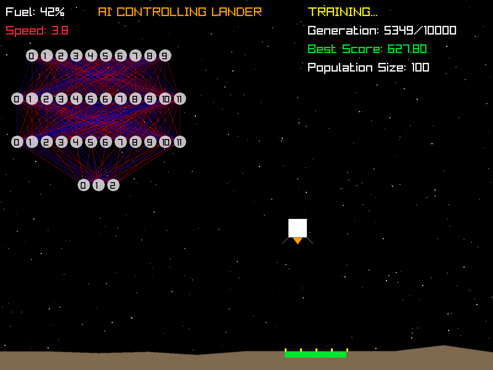
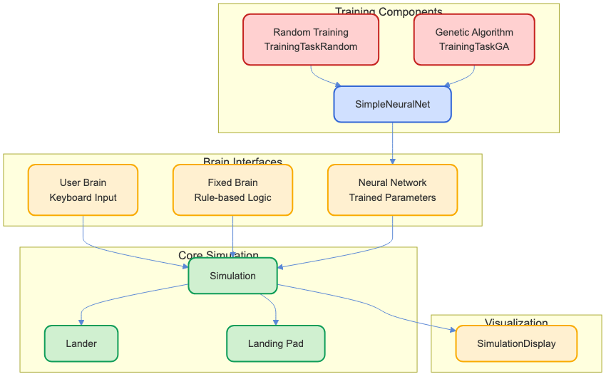

<!-- _class: centered -->

# NNLander

## Minimal Neural Networks for Control Systems
## 制御システムのための最小限のニューラルネットワーク

> An alternative introduction to Neural Networks
> ニューラルネットワークへの別のアプローチ

 
 

by Davide Pasca

v 1.0

<a href="https://github.com/dpasca/NNLander">https://github.com/dpasca/NNLander</a>

---

# Quickstart

| | | |
|---|---|---------------|
| 1 | See the requirements | [English](workshop_requirements_nn_en.txt) or [日本語](workshop_requirements_nn_ja.txt) |
| 2 | Clone this repo | `git clone git@github.com:dpasca/NNLander.git` |
| 3 | Launch the build | `./build.sh` or `build.bat` |
| 4 | Run the demos | `./build/bin/Lander01` or `build\bin\Release\Lander01.exe` |

---

# Goal of this workshop

We aim to demistify NNs by looking at how they work in practice.
このワークショップの目標は、実際にどのように動作するかを見てニューラルネットワークを解明することです。

Actual NNs fundamentals are interesting but confusing !
実際のニューラルネットワークの基礎は興味深いですが、混乱を招きます！

It will still be confusing, it takes time to truly understand something.
それでも混乱するでしょうが、何かを本当に理解するには時間がかかります。

---

# The Lander Simulation/Game

An excellent way to apply NNs. A well defined problem with a set of Inputs and
expected Outputs.

ニューラルネットワークを適用する優れた方法です。入力と期待される出力が明確に定義された問題です。

---

# NNLander in Action

  

---

# Lander01: Manual Control

### Human Brain Interface

- User sees → user presses keys → simulation changes
  ユーザーが見る → キーを押す → シミュレーションが変わる
- Up arrow: vertical thrust
  上矢印: 垂直推力
- Left/right arrows: horizontal thrust
  左右矢印: 水平推力

Try to land on the pad, softly ! (below speed 1.5)
パッドに着陸してみてください、優しく！（速度1.5以下）

---

# Lander02: Rule-based AI

### Fixed Brain Approach

- Pre-programmed rules based on programmer's observation
  プログラマーの観察に基づいた事前プログラムされたルール
- Simple `if-then` logic for different conditions
  異なる条件に対する単純な`if-then`ロジック
- No learning - just fixed behavior
  学習なし - 固定された動作のみ

---

# Lander02: Rule-based AI - Benefits & Limitations

- **Benefits**: Predictable, explainable behavior, efficient
  **利点**: 予測可能で説明可能な動作、効率的
- **Limitations**:
  - Limited adaptation to new scenarios
    新しいシナリオへの適応が限られている
  - Rules must be manually crafted
    ルールは手動で作成する必要がある
  - Complexity increases with more edge cases
    エッジケースが増えると複雑さが増す

---

# Neural Networks are just equations !

NNs are a fancy way of writing equations.
Think of a set of equations that map inputs ($x_1$, $x_2$, $x_3$, ...) to outputs ($y_1$, $y_2$, $y_3$, ...).

ニューラルネットワークは方程式を書くための洗練された方法です。
入力（$x_1$, $x_2$, $x_3$, ...）を出力（$y_1$, $y_2$, $y_3$, ...）にマッピングする一連の方程式を考えてみて

> $f(x_1 \times w_1 + x_2 \times w_2 + x_3 \times w_3 + ...) = y_1$
> $f(x_1 \times w_4 + x_2 \times w_5 + x_3 \times w_6 + ...) = y_2$

---

# Neural Networks are just equations !

The "brain" is in the weights of the equations.

「脳」は方程式の重みにあります。

> $f(x_1 \times w_1 + x_2 \times w_2 + x_3 \times w_3 + ...) = y_1$
> $f(x_1 \times w_4 + x_2 \times w_5 + x_3 \times w_6 + ...) = y_2$

Training is the art of finding the best weights that give desired Outputs for given Inputs.

トレーニングは、与えられた入力に対して望ましい出力を得るための最適な重みを見つける技術です。

  

---

# Lander03: Neural Network Training

### Random Training Approach

- Neural network with randomly generated parameters
- Run many simulations with different parameters
- Keep the best performing network

### Training Process
- Initialize parameters randomly
- Evaluate performance (scoring)
- Save parameters if they're better than the best so far
- Repeat for many epochs

---

# Random Training Process

  

---

# Lander04: Genetic Algorithm Training

### Population-based Training

- Maintain a population of neural networks
- Use genetic principles: selection, crossover, mutation
- Evolve better solutions over generations

### Benefits
- More efficient search of parameter space
- Can escape local optima
- Faster convergence to good solutions

---

# Genetic Algorithm Process

  

---

# Comparing the Approaches

| Approach | Advantages | Limitations | Learning |
|----------|------------|-------------|----------|
| **Manual** | Full control | Human error | Direct feedback |
| **Rule-based** | Predictable | Not adaptable | None |
| **Random Training** | Simple to implement | Inefficient | Slow |
| **Genetic Algorithm** | Efficient, adaptable | More complex | Faster |

---

# Workshop Hands-on Activities

### What You'll Do

1. **Build the project** with CMake
2. **Run each demo** to observe different behaviors
3. **Visualize the neural network** learning process
4. **Experiment with parameters**:
   - Network architecture
   - Training parameters
   - Scoring functions
5. **Optimize and compare** different approaches

---

# Key Insights & Takeaways

### Neural Networks Can:

- Learn complex behaviors without explicit programming
- Adapt to changing conditions
- Solve problems where rules are hard to define

### Important Considerations:

- Training method significantly impacts performance
- Architecture design matters
- Scoring/fitness function design is critical

---

# Thank You!

**Resources:**
- [OpenAI API Documentation](https://platform.openai.com/docs/)
- [Ollama Project](https://ollama.ai/)
- [Node.js Documentation](https://nodejs.org/en/docs/)

**Contact:**

*Davide Pasca*:
- [davide@newtypekk.com](mailto:davide@newtypekk.com)
- [github.com/dpasca](https://github.com/dpasca)
- [newtypekk.com](https://newtypekk.com)
- [x.com/109mae](https://x.com/109mae)

---

# Appendix: Simulation Components

  

